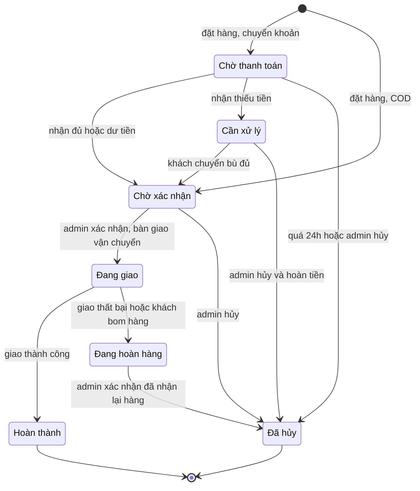

# User stories

Mẫu: **Là** <vai trò>, **tôi muốn** <hành động>, **để** <mục đích>.
Mỗi story kèm *Tiêu chí chấp nhận* — điều kiện cụ thể để biết story đã làm xong. Sau này mỗi tiêu chí sẽ thành một test case.

Vai trò: **Khách** (không cần tài khoản) · **Admin** (thành viên nhóm shop)

Mức ưu tiên (MoSCoW): **Must** = bắt buộc cho bản ra mắt · **Should** = nên có, làm ngay sau ra mắt · **Could** = làm khi có thời gian

## Tổng hợp

| Mã | Story | Ưu tiên | Giai đoạn |
|---|---|---|---|
| US-01 | Khách xem sản phẩm theo danh mục | Must | 2, 4 |
| US-03 | Khách xem chi tiết sản phẩm, chọn size/màu | Must | 2, 4 |
| US-04 | Khách tìm kiếm và lọc sản phẩm | Should | 2, 4 |
| US-05 | Khách quản lý giỏ hàng | Must | 4 |
| US-06 | Khách đặt hàng | Must | 5 |
| US-07 | Khách thanh toán chuyển khoản bằng VietQR | Must | 5 |
| US-08 | Khách tra cứu đơn hàng | Should | 5 |
| US-09 | Admin đăng nhập / đăng xuất | Must | 3 |
| US-10 | Admin quản lý sản phẩm | Must | 2, 6 |
| US-11 | Admin quản lý tồn kho | Must | 6 |
| US-12 | Admin xem và lọc danh sách đơn | Must | 6 |
| US-02 | Admin cập nhật trạng thái đơn hàng | Must | 6 |
| US-13 | Admin xem thống kê doanh thu | Could | 6 |

---

## Khách

### US-01 · Xem sản phẩm theo danh mục
**Là** khách, **tôi muốn** xem danh sách sản phẩm theo danh mục (Áo, Quần, Giày…), **để** nhanh chóng tìm món mình cần.

Tiêu chí chấp nhận:
- [ ] Mỗi sản phẩm hiện: ảnh, tên, giá (nếu có khuyến mãi thì hiện giá gốc gạch ngang)
- [ ] Sản phẩm đã hết hàng ở mọi size vẫn hiện nhưng có nhãn "Hết hàng"
- [ ] Sản phẩm admin đã ẩn không xuất hiện
- [ ] Mỗi trang tối đa 12 sản phẩm, có phân trang
- [ ] Hiển thị tốt trên màn hình rộng 375px

### US-03 · Xem chi tiết sản phẩm, chọn size/màu
**Là** khách, **tôi muốn** xem ảnh, mô tả, bảng size và chọn đúng size/màu, **để** mua được món vừa với mình.

Tiêu chí chấp nhận:
- [ ] Có nhiều ảnh, vuốt/bấm để xem ảnh tiếp theo
- [ ] Phải chọn đủ size và màu thì nút "Thêm vào giỏ" mới bấm được
- [ ] Tổ hợp size/màu đã hết hàng hiện mờ, không chọn được
- [ ] Còn từ 5 sản phẩm trở xuống thì hiện "Chỉ còn N sản phẩm"
- [ ] Có nút mở bảng size (cm / kg tương ứng từng size)
- [ ] Chia sẻ link lên Facebook/Zalo hiện đúng ảnh, tên và giá sản phẩm

### US-04 · Tìm kiếm và lọc sản phẩm
**Là** khách, **tôi muốn** tìm theo tên và lọc theo danh mục, môn thể thao, khoảng giá, **để** không phải lướt hết toàn bộ sản phẩm.

Tiêu chí chấp nhận:
- [ ] Tìm không phân biệt hoa thường và dấu: gõ "ao chay bo" ra "Áo chạy bộ"
- [ ] Lọc kết hợp được nhiều điều kiện cùng lúc
- [ ] Sắp xếp theo: mới nhất, giá tăng dần, giá giảm dần
- [ ] Điều kiện lọc nằm trên URL (vd `?mon=chay-bo&gia_max=300000`) để gửi link cho bạn bè thấy đúng kết quả
- [ ] Không có kết quả thì hiện thông báo và gợi ý vài sản phẩm nổi bật

### US-05 · Quản lý giỏ hàng
**Là** khách, **tôi muốn** thêm, sửa số lượng, xóa sản phẩm trong giỏ, **để** chuẩn bị đơn trước khi đặt.

Tiêu chí chấp nhận:
- [ ] Biểu tượng giỏ trên thanh menu hiện tổng số sản phẩm
- [ ] Giỏ vẫn còn khi đóng trình duyệt rồi mở lại
- [ ] Không tăng số lượng vượt quá tồn kho của biến thể đó
- [ ] Tổng tiền cập nhật ngay khi đổi số lượng
- [ ] Khi mở giỏ, nếu giá hoặc tồn kho đã thay đổi so với lúc thêm vào thì báo rõ món nào thay đổi

### US-06 · Đặt hàng
**Là** khách, **tôi muốn** đặt hàng chỉ với tên, số điện thoại, địa chỉ mà không cần tạo tài khoản, **để** mua nhanh.

Tiêu chí chấp nhận:
- [ ] Bắt buộc: họ tên, SĐT (10 số, bắt đầu bằng 0), tỉnh/thành, quận/huyện, phường/xã, địa chỉ cụ thể. Ghi chú không bắt buộc
- [ ] Chọn phương thức thanh toán: COD hoặc chuyển khoản
- [ ] Hiện phí ship; đơn từ ngưỡng miễn phí ship trở lên thì phí ship = 0 (ngưỡng do admin cấu hình)
- [ ] **Server tự tính lại** giá và tổng tiền, không dùng số tiền trình duyệt gửi lên
- [ ] Tồn kho bị trừ ngay khi tạo đơn; nếu có món vừa hết hàng thì không tạo đơn và báo rõ món đó
- [ ] Bấm "Đặt hàng" hai lần liên tiếp chỉ tạo **một** đơn
- [ ] Đặt thành công: hiện trang xác nhận có mã đơn (vd `SP2612-0042`), giỏ hàng được xóa
- [ ] Đơn COD vào trạng thái *Chờ xác nhận*; đơn chuyển khoản vào *Chờ thanh toán*

### US-07 · Thanh toán chuyển khoản bằng VietQR
**Là** khách, **tôi muốn** quét mã QR để chuyển khoản đúng số tiền và nội dung, **để** không phải gõ tay số tài khoản.

Tiêu chí chấp nhận:
- [ ] Mã QR có sẵn số tiền và nội dung chuyển khoản = mã đơn
- [ ] Hiện kèm số tài khoản, tên ngân hàng, nút sao chép từng thông tin
- [ ] Khi ngân hàng báo tiền vào (webhook), đơn tự chuyển sang *Chờ xác nhận* và trang thanh toán tự hiện "Đã nhận tiền" mà khách không cần tải lại
- [ ] Webhook không có chữ ký hợp lệ bị từ chối
- [ ] Cùng một giao dịch gửi webhook nhiều lần chỉ được xử lý **một** lần
- [ ] Chuyển **thiếu** tiền: đơn chuyển sang *Cần xử lý*, **không bị tự hủy**, admin được thông báo
- [ ] Chuyển **dư** tiền: đơn vẫn chuyển sang *Chờ xác nhận*, admin được thông báo để hoàn phần dư
- [ ] Quá 24 giờ mà **chưa nhận được đồng nào**: đơn tự hủy và tồn kho được cộng trả lại
- [ ] Tiền về cho một đơn **đã hủy**: không tự mở lại đơn, admin được thông báo để hoàn tiền

### US-08 · Tra cứu đơn hàng
**Là** khách, **tôi muốn** xem đơn của mình đang ở bước nào, **để** biết khi nào nhận được hàng.

Tiêu chí chấp nhận:
- [ ] Tra cứu bằng **cả** mã đơn **và** SĐT (chỉ một trong hai thì người khác có thể đoán)
- [ ] Hiện trạng thái hiện tại và các mốc thời gian đã qua
- [ ] Địa chỉ và SĐT hiển thị bị che bớt (vd `09xx xxx 123`)
- [ ] Nhập sai quá 10 lần trong 15 phút thì tạm khóa tra cứu từ thiết bị đó

---

## Admin

### US-09 · Đăng nhập / đăng xuất
**Là** admin, **tôi muốn** đăng nhập bằng email và mật khẩu, **để** chỉ người trong nhóm mới vào được trang quản trị.

Tiêu chí chấp nhận:
- [ ] Mật khẩu được lưu dạng băm (bcrypt), không bao giờ lưu nguyên văn
- [ ] Sai email hoặc mật khẩu chỉ báo chung "Thông tin đăng nhập không đúng" (không nói rõ sai cái nào)
- [ ] Sai 5 lần liên tiếp thì khóa tài khoản 15 phút
- [ ] Phiên đăng nhập tự hết hạn sau 8 giờ
- [ ] Mọi API quản trị trả về 401 nếu chưa đăng nhập

### US-10 · Quản lý sản phẩm
**Là** admin, **tôi muốn** thêm, sửa, ẩn sản phẩm cùng các biến thể size/màu, **để** cập nhật hàng mới lên web.

Tiêu chí chấp nhận:
- [ ] Nhập: tên, danh mục, môn thể thao, mô tả, ảnh, và danh sách biến thể (size, màu, SKU, giá, giá khuyến mãi)
- [ ] SKU không được trùng; giá khuyến mãi phải nhỏ hơn giá gốc
- [ ] Ảnh chỉ nhận jpg/png/webp, tối đa 2 MB mỗi ảnh, tối đa 8 ảnh
- [ ] Sản phẩm đã từng có trong đơn hàng thì chỉ **ẩn**, không xóa hẳn
- [ ] Đổi giá không làm thay đổi giá của các đơn đã đặt trước đó

### US-11 · Quản lý tồn kho
**Là** admin, **tôi muốn** nhập thêm hàng và xem tồn kho theo từng size/màu, **để** biết lúc nào cần đặt hàng bổ sung.

Tiêu chí chấp nhận:
- [ ] Bảng tồn kho theo từng biến thể; biến thể dưới ngưỡng tồn tối thiểu được tô màu
- [ ] Mỗi lần nhập/điều chỉnh kho phải ghi lý do; lưu lịch sử: ai, lúc nào, thay đổi bao nhiêu
- [ ] Tồn kho không bao giờ âm

### US-12 · Xem và lọc danh sách đơn
**Là** admin, **tôi muốn** xem đơn mới và lọc theo trạng thái, ngày, **để** xử lý đơn kịp thời.

Tiêu chí chấp nhận:
- [ ] Lọc theo trạng thái, khoảng ngày; tìm theo mã đơn hoặc SĐT
- [ ] Đơn mới nhất lên đầu, có phân trang
- [ ] Xem chi tiết: sản phẩm, số lượng, giá lúc mua, thông tin khách, lịch sử trạng thái
- [ ] Có đơn mới thì nhóm nhận thông báo (Telegram hoặc email)

### US-02 · Cập nhật trạng thái đơn hàng
**Là** admin, **tôi muốn** chuyển trạng thái đơn theo đúng quy trình, **để** cả nhóm biết đơn đang ở bước nào.

Tiêu chí chấp nhận:
- [ ] Chỉ được chuyển theo bảng *Trạng thái đơn hàng* bên dưới; chuyển sai trả về lỗi
- [ ] Tồn kho được cộng lại đúng thời điểm ghi ở cột *Tồn kho* của bảng đó
- [ ] Hủy đơn đã nhận tiền (từ *Cần xử lý*) phải ghi số tiền đã hoàn và ngày hoàn
- [ ] Lưu lại ai đổi, đổi lúc nào, lý do (bắt buộc khi hủy)

### US-13 · Thống kê doanh thu
**Là** admin, **tôi muốn** xem doanh thu và sản phẩm bán chạy, **để** quyết định nhập thêm hàng gì.

Tiêu chí chấp nhận:
- [ ] Doanh thu, số đơn, giá trị đơn trung bình theo ngày / tháng
- [ ] Chỉ tính đơn ở trạng thái *Hoàn thành*
- [ ] Top 5 sản phẩm bán chạy theo số lượng

---

## Trạng thái đơn hàng

| Từ | Sang | Ai / cái gì kích hoạt | Tồn kho |
|---|---|---|---|
| *(mới)* | Chờ thanh toán | Khách đặt, chọn chuyển khoản | Trừ ngay |
| *(mới)* | Chờ xác nhận | Khách đặt, chọn COD | Trừ ngay |
| Chờ thanh toán | Chờ xác nhận | Webhook: nhận đủ hoặc dư tiền | — |
| Chờ thanh toán | Cần xử lý | Webhook: nhận thiếu tiền | — |
| Chờ thanh toán | Đã hủy | Hệ thống (quá 24h, chưa nhận tiền) hoặc admin | Cộng lại ngay |
| Cần xử lý | Chờ xác nhận | Webhook hoặc admin: khách đã chuyển bù đủ | — |
| Cần xử lý | Đã hủy | Admin, sau khi hoàn tiền cho khách | Cộng lại ngay |
| Chờ xác nhận | Đang giao | Admin | — |
| Chờ xác nhận | Đã hủy | Admin | Cộng lại ngay |
| Đang giao | Hoàn thành | Admin | — |
| Đang giao | Đang hoàn hàng | Admin: giao thất bại / khách bom hàng | **Chưa** cộng – hàng còn trên đường về |
| Đang hoàn hàng | Đã hủy | Admin: đã nhận lại hàng tại kho | Cộng lại lúc này |

*Hoàn thành* và *Đã hủy* là trạng thái kết thúc: không chuyển đi đâu được nữa.

---

## Yêu cầu phi chức năng

| Nhóm | Yêu cầu |
|---|---|
| Thiết bị | Dùng tốt từ màn hình 375px; ưu tiên thiết kế cho điện thoại |
| Tốc độ | Trang sản phẩm tải xong phần chính (LCP) dưới 2,5 giây trên mạng 4G; điểm Lighthouse mobile ≥ 80 |
| Bảo mật | Toàn bộ chạy HTTPS; không lưu thông tin thẻ ngân hàng; khóa API, mật khẩu chỉ nằm trong biến môi trường |
| Dữ liệu cá nhân | Thông tin khách (tên, SĐT, địa chỉ) chỉ admin xem được; có trang chính sách bảo mật |
| Sao lưu | Cơ sở dữ liệu sao lưu tự động mỗi ngày, giữ 7 bản gần nhất |
| Hiển thị | Giao diện tiếng Việt; tiền định dạng `219.000 ₫`; ngày `dd/mm/yyyy` |

---

## Tự kiểm tra (trả lời trước khi sang thiết kế ERD)

1. US-06 yêu cầu server tự tính lại tổng tiền. Nếu dùng luôn số tiền trình duyệt gửi lên thì kẻ xấu làm được gì?
2. US-06 và US-07 đều có tiêu chí "chỉ xử lý **một** lần". Hai tình huống này khác nhau ở đâu, và mỗi cái có thể giải quyết thế nào?
3. US-10 nói sản phẩm đã có đơn thì chỉ ẩn, không xóa. Nếu xóa hẳn thì bảng đơn hàng gặp vấn đề gì?
4. Vì sao US-09 không nên báo rõ "sai mật khẩu" hay "email không tồn tại"?
5. Story nào trong file này sẽ cần **transaction** của cơ sở dữ liệu? Vì sao?
