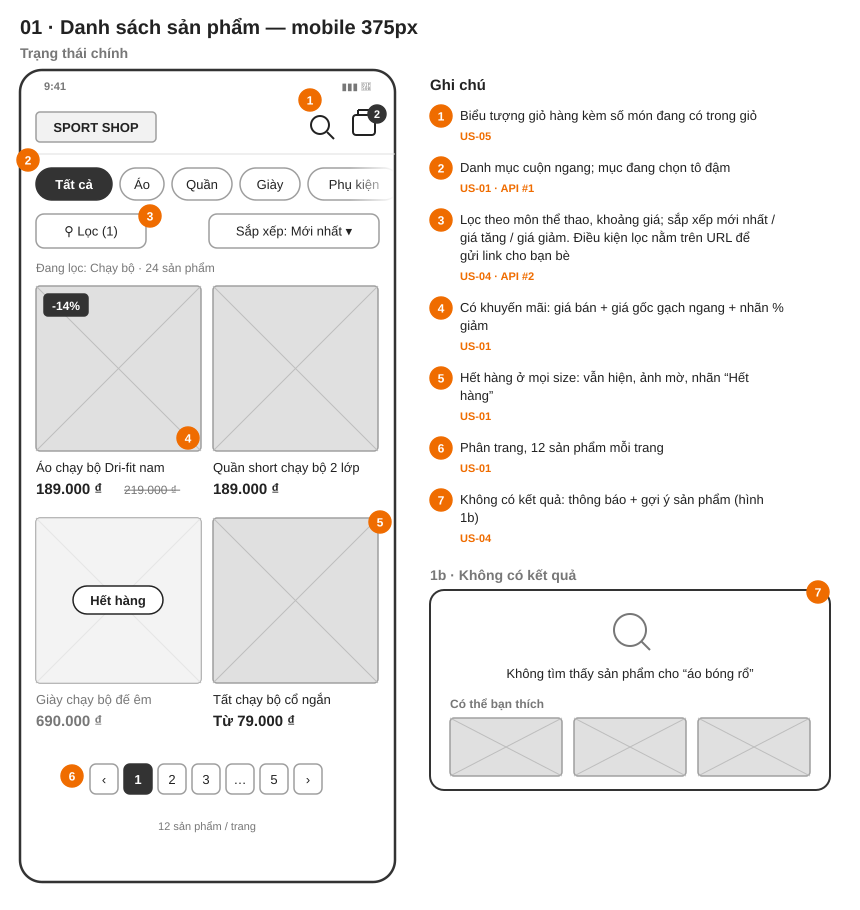
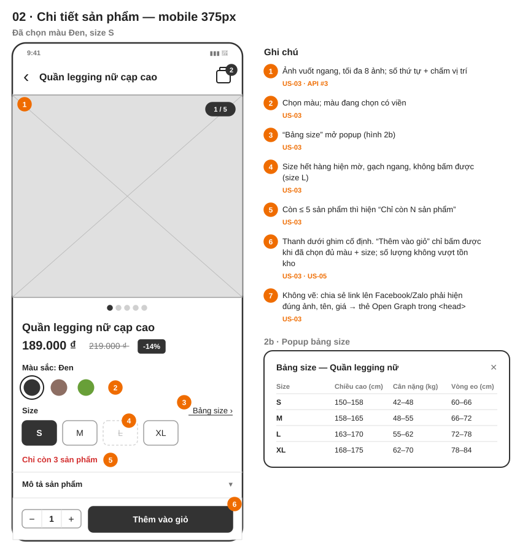
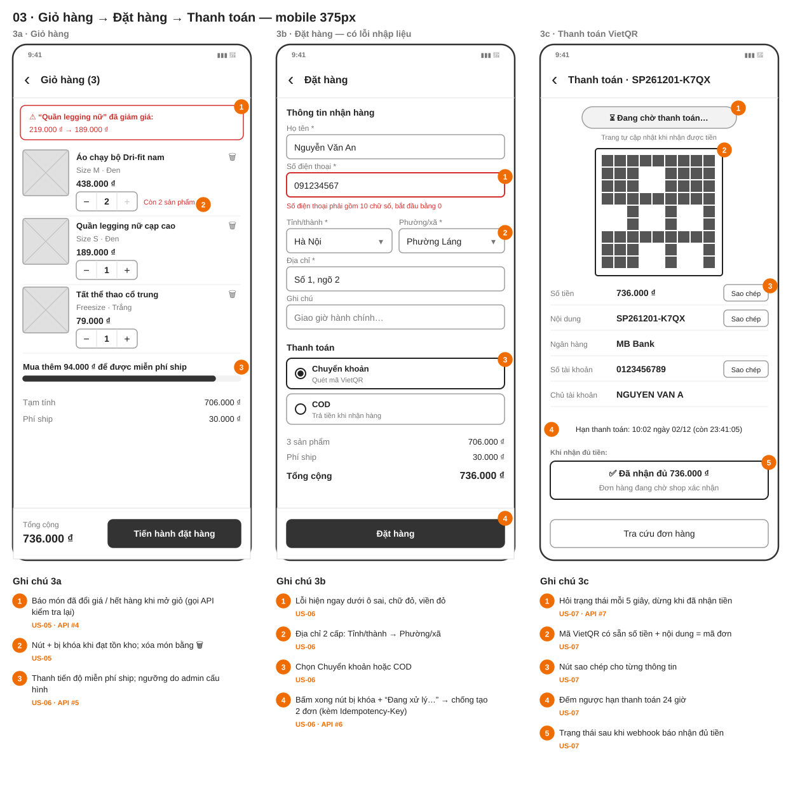
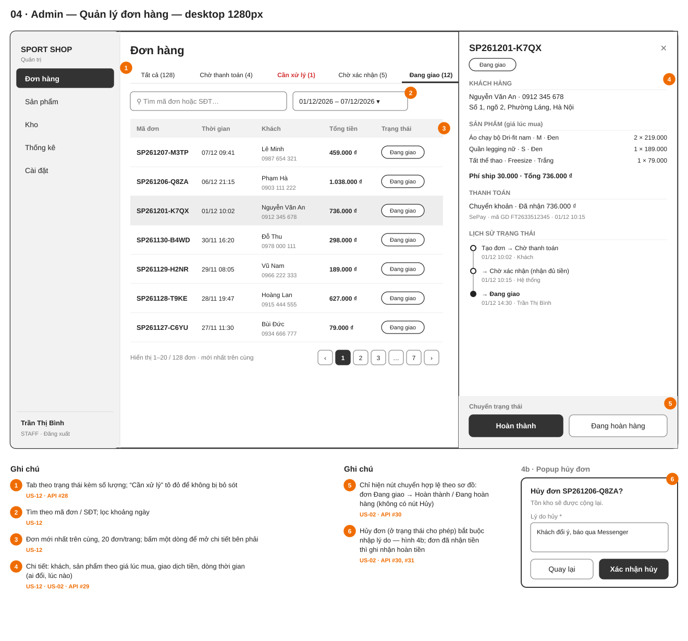

# Wireframe

Bản phác bố cục (low-fidelity, chỉ dùng màu xám) cho 4 màn hình chính — Giai đoạn 1, bước 5.
Mỗi vòng số màu cam trỏ tới một ghi chú, ghi rõ **user story** và **endpoint** ([api.md](../api.md)) liên quan.

| # | Màn hình | Khung | User story | API |
|---|---|---|---|---|
| 01 | [Danh sách sản phẩm](01-danh-sach-san-pham.svg) (+ trạng thái không có kết quả) | Mobile 375px | US-01, 04, 05 | #1, #2 |
| 02 | [Chi tiết sản phẩm](02-chi-tiet-san-pham.svg) (+ popup bảng size) | Mobile 375px | US-03, 05 | #3 |
| 03 | [Giỏ hàng → Đặt hàng → Thanh toán](03-gio-hang-dat-hang-thanh-toan.svg) | Mobile 375px × 3 | US-05, 06, 07 | #4 – #7 |
| 04 | [Admin — Quản lý đơn hàng](04-admin-quan-ly-don.svg) (+ popup hủy đơn) | Desktop 1280px | US-02, 12 | #28 – #31 |

## Sửa wireframe
Các file `.svg` được **sinh từ** [`generate.py`](generate.py) — sửa trong script rồi chạy lại, không sửa tay file SVG:
```bash
python docs/wireframes/generate.py
```

## 01 · Danh sách sản phẩm


## 02 · Chi tiết sản phẩm


## 03 · Giỏ hàng → Đặt hàng → Thanh toán


## 04 · Admin — Quản lý đơn hàng

